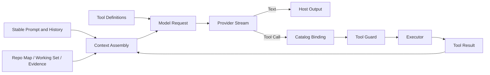

# Model、Context 与 Tool 如何协作

## 学习目标

理解 Model 与 Provider 的边界、稳定和动态 Context 的组装方式、Tool Definition 如何
进入受治理执行，以及非终态 Tool Result 如何触发下一次 Model Sample。

## 前置知识

阅读[一次 Agent Turn 的完整生命周期](./05-turn-lifecycle.md)。

## 问题背景

Model 不直接访问仓库，只能看到单次 Request 中的 Message 与 Tool Definition。Tool
没有独立意图。没有 Tool 的 Context 只能解释，缺少 Context 的 Tool 会盲目行动，
缺少治理的 Model 则可能请求危险副作用。Runtime 必须连接三者，同时保持职责分离。

## 核心概念

- **Model** 描述推理 Capability 与 Limit。
- **Provider** 传输规范化 Model Request 并返回 Stream。
- **Context** 是一次 Sample 中提供给 Model 的有界信息。
- **Tool Definition** 是 Model 可见的名称、描述和 Input Schema。
- **Tool Call** 是不可信的 Sampled Data。
- **Tool Registry** 将 Call 解析为当前 Catalog Identity 与 Executor。
- **Tool Result** 是追加回 Conversation 的结构化证据。

## 协作循环



一个 Turn 可以多次 Sample。Context 与 Catalog 在规定边界重新计算，Identity 防止旧
Tool Call 静默调用已替换 Executor。

## 三类 Snapshot

协作循环需要不同稳定规则：

| Snapshot | 稳定范围 | 原因 |
| --- | --- | --- |
| Turn Policy/Route | 整个 Turn | Mid-turn Reload 不应改变 Authority/Model |
| Tool Catalog Binding | Sampled Call | 同名 Tool Replacement 不重定向旧 Proposal |
| Volatile Context Tail | 单次 Sample | Tool Result、Evidence、Risk 必须演化 |

冻结全部内容会隐藏新 Observation；每次重建全部内容会破坏 Authority Consistency 和
Prompt Cache。QCode 在最小正确 Scope 冻结 Identity/Authority，并在预期变化处
重建 Observational Context。

## Model 与 Provider

`internal/adapter/model` 管理 Catalog Descriptor、Capability、Limit、Pricing、Route
与 Credential Reference。Resolved `ReadyRoute` 包含 Provider、Model、Protocol、
Endpoint 与能力。

`internal/adapter/provider` 定义规范化 Message、Content Block、Tool Call、Model
Request、Usage、Citation、Stream Event 和极小的 `Provider.Stream` Interface。
不同厂商 Adapter 将 OpenAI Chat、Responses、Anthropic 或 Fixture 转换为共享 Stream，
Agent Engine 无需解析每种 Wire Protocol。

Capability 是可执行契约：例如 Model 未声明 Tool Call 时，带 Tool 的 Request 会被拒绝。

## Context 架构

Context 按稳定度和 Authority 组装：

1. Base System Constraint 与 Coding Policy；
2. Mode 与 Security Posture；
3. 当前 Owner State 构造的 Bounded Truth Capsule；
4. 可选且非权威的 Semantic Narrative；
5. 保持 Tool Pair 完整的 Recent Raw Tail；
6. 动态 Repo Map、Working-set Ledger、Evidence、Memory 与 Reminder。

Mandatory Truth 在模型上下文过载前通过 Admission 保留；Narrative 只能解释设计动机，
不能声明测试、修改、审批或权限事实。Authority Digest 只覆盖 Mandatory Truth。
Compaction 每代都从当前 Owner State 和近期原文重建，不能递归总结旧 Narrative。

`prompt.Assemble` 按显式 Byte/Token Budget 创建稳定 Partition 与 Receipt；
`AssembleTurn` 在每次 Request 尾部渲染动态 Partition。动态尾部放在最后，可以保留
Byte-identical Prefix 以利用 Provider Prompt Cache。

Receipt 记录 Original/Retained Size 与 Truncation Reason，使 Missing、Empty 和
Truncated 具有不同可观察语义。Memory 在 Turn Admission 时按当前 Generation 和 Scope
检索并冻结，因此本 Turn 的 Memory 写入只在下一 Turn 可见。

## Working Set 与 Evidence

Working Set 保存 Path 和 Provenance，不重复保存文件内容。Evidence 保存搜索/读取确认的
Fact、未验证 Change、Blind Change、Open Diagnostics 与重复工作的 Reminder。

Risk 排在 Fact 前面，因为 Prefix-preserving Budget Cut 应优先保留可行动的不确定性。

## Tool Discovery 与 Binding

Registry 暴露 Eager Tool Definition，并可将大型 Catalog 延迟到 Tool Search。每个
Snapshot 有 Catalog ID、Generation、Revision 与 Authority；Provider 只看到公共 Schema。

Tool Call 在执行前绑定到曾展示它的 Snapshot。Executor 被 Replace/Revoked 时 Fail
Closed。

## Tool Execution 与 Feedback

Engine 按 Concurrency/Resource Rule 调度 Call，并统一经过 Guard。

Result 可以包含 Content、Metadata、File Change、Error Category 和大输出 Handle。
成功或 Recoverable Failure 作为 Tool Message 追加到 Conversation。非终态 Result
可以触发下一次 Sample，让 Model 基于证据继续或修正 Argument；已接受的
`turn_complete` Result 则直接发布其 `summary`，不再发起下一次 Sample。

模型停止调用工具并写出非空用户可见正文即可结束 Turn。`turn_complete` 可选：
`status=complete` 用 `summary` 精确替换已捕获答案，`status=incomplete` 记录可恢复
的 Pending Actions。Mutation 仍走 Journal 与 Verify Gate；默认 Verify 失败只报告
风险，不撤销停轮。普通 Sample 和跨 Turn 请求逐字保留已发送的 Tool Result；只有显式
compaction/rebase 才能把大 Tool Result 降级为有界 Surface 与 Handle，完整内容仍由
Result Store 保存并可按需重取。

## 代码地图

| 关注点 | 源码 |
| --- | --- |
| Model Catalog/Route | `internal/adapter/model` |
| Request/Stream | `internal/adapter/provider/types.go` |
| HTTP Provider | `internal/adapter/provider/httpclient` |
| Tool Registry/Claim | `internal/adapter/tool/tool.go` |
| Context | `internal/runtime/agent/prompt` |
| Truth/Narrative | `internal/runtime/agent/context` |
| Working Set/Evidence | `internal/runtime/agent/context`、`evidence` |
| Collaboration Loop | `internal/runtime/agent/engine/turn_handler.go` |
| Default Budget | `internal/runtime/app/wire/route.go` |

## 设计取舍与替代方案

发送完整仓库会超出 Context、增加成本并降低相关性；只发送用户选中文件又会遗漏结构。
QCode 组合有界 Repository Structure、Observed Working State、Evidence 和
On-demand Tool。

Turn 开始时冻结全部 Prompt 会忽略后续 Tool Result；每次重建所有内容会破坏 Prompt
Cache。Stable Prefix + Volatile Tail 在两者间平衡。

## 失败模式与安全边界

- Credential、Protocol、Limit 或 Capability 不一致时 Route Resolution 失败。
- Unknown Tool Call 成为受控 Failure。
- Unadvertised 或 Revoked Tool 不执行。
- Context Truncation 写入 Receipt。
- Mandatory Truth 无法 Admission 时在状态或副作用提交前失败。
- Narrative 生成失败回退到 Truth + Recent Raw Tail。
- Tool Schema/Count Budget 限制 Catalog 占用。
- Tool Result 即使来自成功执行，仍是不可信 Model Input。
- Credential Value 在 Provider Client 解析，不进入 Prompt。

## 测试与验证

```bash
go test ./internal/runtime/agent/prompt \
  -run 'TestAssembleTurn(RendersBothSectionsAsSystemMessages|ReportsBudgetTruncation)'
go test ./internal/runtime/agent/engine \
  -run 'Test(EngineExecutesToolAndFeedsResultOnce|SamplingFailsClosedUntilToolCatalogSyncRecovers|TurnContextRebuildsWithinTheSameTurn)'
```

## 动手实验

运行 Hermetic Fixture，并在 `turn.receipt` 中观察 Context Section、Route 与 Usage：

```bash
go test ./internal/host/runtimeapi/web -run TestWebHostMeetsTheRuntimeContract
go test ./internal/host/bench -run TestCodingBenchmarkSuite
```

固定 Prompt 属于确定性 Fixture Contract，不是 Model 的通用限制。

## 复习问题

1. 为什么 Provider 不是 Model 的同义词？
2. 为什么动态 Context 放在 Durable History 后面？
3. 什么机制阻止 Tool Call 调用被替换的 Executor？
4. 哪些数据 Turn-stable、Call-bound 或 Per-sample Rebuild？

## 延伸阅读

- [Context Engineering 规划目录](../NAVIGATION.md)
- [Guard、Approval、Constitution 与 Sandbox](../07-security-governance/03-approval-constitution-sandbox.md)

## 事实来源与验证

| 项目 | 值 |
| --- | --- |
| Catalog ID | `overview-model-context-tool` |
| 状态 | `draft` |
| 最后验证 | 尚未验证 |
