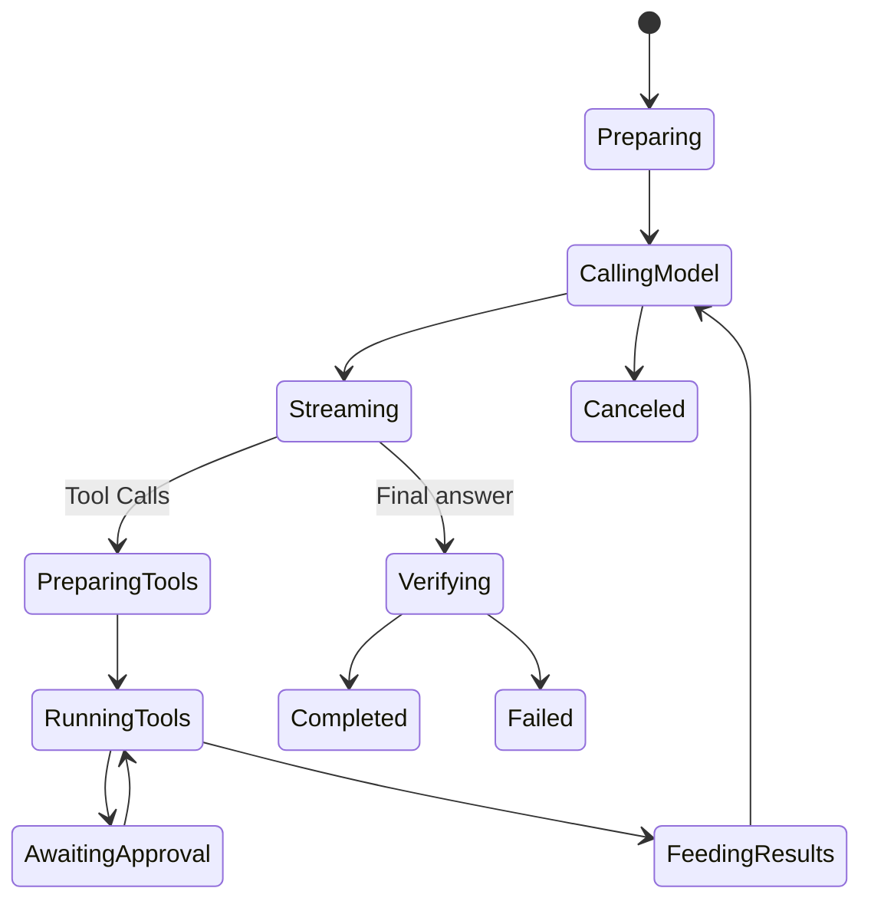

# 模型与工具执行循环

## 学习目标

追踪一次 Engine Step，理解 Sampling Snapshot 与 Tool Scheduling，并识别终止 Iterative
Turn 的 Gate。

## 前置知识

阅读 [Application Runtime](./02-application-runtime.md)。

## 问题背景

Agent Turn 不等于一次 Model Call。模型可能请求 Tool、消费 Result、修改计划、等待
Input 并再次 Sample。无界 Loop 会无限消耗，Stale Capability 也可能被误执行。

## State Machine



上图是概念视图。代码中 `turnkernel.Reducer` 是状态转换以及 Repair、Verification、
Terminal Decision 的唯一生产 Owner；`TurnCoordinator` 是 `Reducer.Apply` 的唯一
生产调用方。Engine Handler 只执行 Effect 并投影 Progress，Engine Event 不会反向
生成 Command 驱动 Reducer。

## Sampling Boundary

Turn 开始时 Engine 冻结 `TurnSpec`：Identity 与 Request、Session Profile、Route、
Policy、Limits、Prompt Prefix、Tool Catalog、Skills、MCP Health 与 Extension
Snapshot。冻结的 Spec 打开 `engine.Scope`，由它持有 Turn 局部的 Kernel、Trace、
Diagnostics、Verification、Tool Spend、Diff 与 Control 状态。Sample 前从
Scope-local 状态组装 Stable History 与 Volatile Context；`ModelRequest` 只包含
Catalog Budget 允许的 Tool Definition。

出现 Meaningful Stream Data 后不再盲目 Retry Provider，因为 Output/Tool Call 可能
已经影响外部状态。

## Tool Round Trip

Provider Assembly 把 Stream Fragment 组装为完整 Tool Call，并绑定 Local Catalog
Identity。`tool.ExecuteBatch` 根据已经冻结的 Replay/Parallel Plan 执行 Serial 或
Concurrent Call，执行本身统一经过 Guard。

Provider、Tool、Approval、Input、Verification 和 Journal 工作都表示为显式 Kernel
Effect。`DurableEffectDispatcher` 在外部执行前记录 `EffectStarted`，并保留首个
Result Command，直到 Coordinator Durable Accept。恢复时，Running Effect 先持久化为
`EffectRequeued`，再依据 Durable Payload 与 Idempotency Key 重新 Dispatch。

Batch 完成前不会把 Partial Result 作为完整 Tool Message 发布。Batch Settled 后，
Result 使用相同 Call ID 写入 History，下一 Sample 获得完整因果关系。

Recoverable Tool Failure 可以分类后反馈给模型；Security、Budget、Cancellation 与
Invariant Failure 必须终止，不能邀请模型绕过。

## Turn Control

Cancel、Steer、Approval 与 Input 请求都通过 Scope 的 `ControlPort` 进入，并由
有界 Mailbox 串行化。Request Ledger 会拒绝迟到、重复或针对错误等待类型的
Resolution，防止 Stale Host Reply 干扰已前进的 Turn。

## 将一次 Iteration 视为 Transaction

每轮 Model/Tool Iteration 都有 Provisional 与 Committed 两侧：

```text
persist requested Effect in a Domain Fact
  -> persist EffectStarted
  -> snapshot route/policy/catalog
  -> assemble request
  -> stream provisional output / complete tool calls
  -> submit one retained Result Command
  -> persist resulting state/Effects as ordered Domain Facts
  -> validate/bind/schedule/execute Tool Effects
  -> append paired assistant call + tool result
  -> next sample / final verification
  -> atomically commit Terminal Envelope and Session Delta
```

History Commit 前 Live Event 已可观察，这是有意设计：用户需要 Progress，但未来 Model
Context 绝不能含有无 Matching Result 的 Assistant Tool Call。Failed/Canceled Turn
丢弃 Incoherent Provisional History；Durable Protocol Event 仍保留为 Audit Fact。

这不是跨所有 External Effect 的 Database Transaction。File Write 使用 Guard/Journal，
Remote Effect 需要自己的 Idempotency/Reconciliation。

## State Scope

| Scope | 示例 |
| --- | --- |
| Turn | 冻结的 TurnSpec、Scope 持有的 Kernel/Trace/Diagnostics/Verification/Tool Spend/Control、Workspace Gate、Budget |
| Sample | Volatile Context、Tool Definition、Provider Request、Usage Ordinal |
| Call | Catalog Binding、Argument、Resource Claim、Approval、Result |
| Thread | Committed History、Working Set、Evidence、Compaction Window |

Mid-turn Policy Reload 不应静默扩大 Authority，而 Tool Result 必须进入 Next Sample。
Scope 本身就是 Correctness 的一部分。

## Gate 与 Completion

- 显式 Max Steps 限制普通工作，并在预算外保留受限 Finalization；
- Token/Cost Budget 限制消耗；
- No-progress 状态提示收敛；只有 Lease 耗尽后的 Finalization 才收窄为 Terminal/Input；
- Context Limit 触发 Compaction 或 Failure；
- Pre-sampling Gate 可要求 Plan；
- Workspace Turn Gate 串行化共享 Root 的 Writer；
- Verify Gate 在完成前检查 Change；
- Cancellation 传播到 Provider、Tool 和 Wait。

只有成功且一致的 Turn History 被 Commit；Failed History 可以 Rollback，防止后续
Turn 把不完整 Tool Exchange 当成事实。

## 代码地图

| 关注点 | 源码 |
| --- | --- |
| 生产入口 | `engine/turn_handler.go` 中的 `Engine.Execute` |
| Loop/Sampling | `engine/turn_handler.go`、`engine/model_handler.go` |
| Provider Stream Assembly | `adapter/provider/assembly/stream_consumer.go` |
| Turn Scope/Mailbox | `engine/turn_scope.go`、`turnkernel/runtime_control.go` |
| Scope State/Control | `turn_scope.go` |
| Session Delta | `session_delta.go` |
| State、Command、Event 与 Effect | `turnkernel/state.go`、`turnkernel/command.go` |
| 权威状态转换 | `turnkernel/reducer_*.go`、`turnkernel/coordinator.go` |
| Durable Effect Routing | `turnkernel/effect_dispatcher.go` |
| Tool Batch/Scheduler | `adapter/tool/batch.go`、`turnkernel/tool_scheduler.go` |
| Failure Class | `tool_failure.go` |
| Verification | `verify.go` |
| Compaction | `compaction.go` |
| Trace/Latency | `tracing.go` |
| Dynamic Context | `workingset.go` |

## 设计取舍与替代方案

Provider-side Agent Loop 会减少本地代码，却把 Tool Authority 与 Observability 移出
Runtime。所有 Tool 串行最确定，但浪费安全并发。QCode 保持本地 Loop，并使用
Descriptor/Resource Scheduling。

## 失败模式与安全边界

- Unknown/Unadvertised Tool 不执行。
- Catalog 在 Sample 与 Execution 间变化时 Fail Closed。
- Tool Call Fragment 必须形成合法 JSON。
- Usage Emit 失败可以使 Turn 失败，避免少计。
- Verify Hard Failure 回滚 Journaled Change。
- Scheduler/Approval Wait 中取消会释放资源。
- Step/Budget Exhaustion 产生显式 Terminal Failure。

## 测试与验证

```bash
go test ./internal/runtime/agent/engine \
  -run 'Test(EngineExecutesToolAndFeedsResultOnce|ToolSchedulerSerialExcludesConcurrent|EngineBudgetAndFailedHistoryRollback|VerifyGateHardFailureFailsTurnAndRollsBack)'
go test ./internal/runtime/agent/turnkernel
```

## 动手实验

跟踪 `TestEngineExecutesToolAndFeedsResultOnce` 的第一条 ModelRequest、Tool Call、
Guard Result、第二条 ModelRequest 和 Final Text，确认 Call ID 配对 Assistant/Tool
Message。

## 复习问题

1. Meaningful Stream Data 为什么改变 Retry 安全性？
2. Batch Result 为什么要在 Batch Settled 后写入 History？
3. 哪些 Failure 可反馈给 Model，哪些必须终止？
4. Model-visible History Commit 前为什么可以有 Live Event？
5. 哪些 State 属于 Turn、Sample、Call、Thread Scope？

## 延伸阅读

- [Streaming、Cancellation 与 Error](./05-streaming-cancellation-errors.md)
- [Tool Guard 执行管线](../06-tools-and-execution/03-tool-guard-pipeline.md)

## 事实来源与验证

| 项目 | 值 |
| --- | --- |
| Catalog ID | `runtime-agent-loop` |
| 状态 | `verified` |
| 最后验证 | 2026-08-23 |
