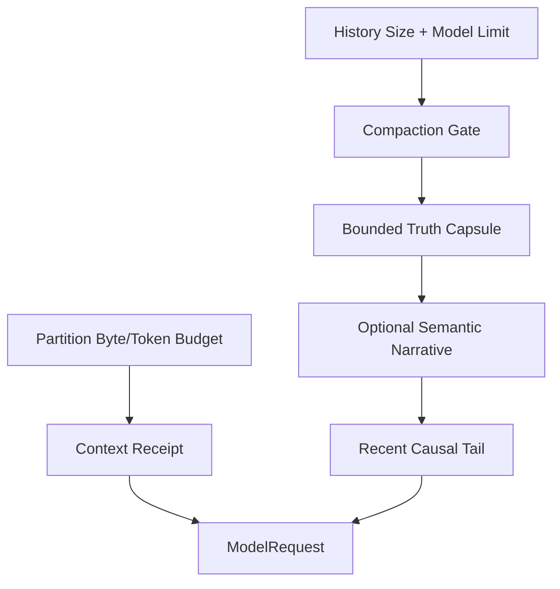

# Token Budget、Compaction 与信息损失

## 学习目标

理解 Partition Budget、Context Window Check、Deterministic Compaction，以及 Receipt
如何显式呈现信息损失。

## 前置知识

阅读 [Context Source、优先级与生命周期](./03-source-priority-lifecycle.md)。

## 问题背景

任意截断字节可能切开 UTF-8、Tool Pair 或 List，并让“缺失”看起来像“完整”。让 Model
自行总结还可能凭空写出“测试已通过”等声明。

## 三层 Context 与分级预算



Partition Budget 在 Assembly 时限制每个 Source。采样路径先按
`context.view.recent_tail_turns` 取最新原文，再按 token residual 从最新闭合因果组向前填充：
`context.view.history_token_ceiling=0` 表示 Mandatory 分区之后的剩余硬输入，显式正值是
Operator Ceiling。超窗时对可见 Tail 再做一次因果组折叠，仍放不下则
`resource_exhausted`。History Replacement 留给显式 `thread.compact` 与 Turn 终态
维护，不再作为每轮 Sample 的默认动作。

## Capacity Accounting

Pre-sampling Decision 的概念公式：

```text
estimated_input_tokens
  + reserved_max_output_tokens
  <= selected_model_context_tokens
```

Input 包括 Stable Partition、History、Volatile Tail、Tool Definition 和 Protocol
Overhead Estimate。即使没有精确 Vendor Tokenizer，Partition Byte Ceiling 仍提供
Deterministic Local Bound 与 UTF-8-safe Retention。

Token Estimate 是带 Method 的 Evidence，不是精确 Provider Bill；Actual Usage 由 Provider
返回并单独记录。

执行预算与 Context 容量不是同一个概念。单 Turn 未显式配置 Token Ceiling 时，从当前
模型 Context Window 派生；Child Tree 未显式配置时，再由父 Turn 容量和并发度派生。
显式值是 Operator Ceiling，不能扩大模型或父级边界。预算耗尽产生带 Scope、Used 和
Limit 的可恢复 `resource_exhausted`，而不是由模型无关固定值直接终止任务。Provider
Throughput（`execution.tokens_per_minute`）是第三条容量平面：合法工作集超过已知
Burst 或等待将超过预算时，先做一次 Visible Tail Fold 再重新准入；仍超则延迟或
拒绝，不静默重探，也不把 `provider_throughput` 当作 History Replacement 原因。

## 三类信息损失

| Mechanism | Scope | Recoverability |
| --- | --- | --- |
| Partition Truncation | 单次 Assembly 的一个 Source | 可重新读取 Original Source |
| Tool/Repo Map Selection | Rank/Count 排除 Entry | 可按需 Search/Read |
| History Compaction | Old Whole-turn Group 被替换 | Durable Event 保留，Model 只见 Summary |

每类需要独立 Receipt；单一 `truncated=true` 无法说明删除了 Bytes、Entry 还是 Causal
History。

Compaction 是 Model-context Loss，不一定删除 Durable Data。Audit/Reconstruction 仍可
保留不再进入 Next Sample 的 Event。

模型可见顺序固定为 Stable Prefix、Session State（Mandatory Truth）、非权威
Narrative、Recent Raw Tail、Dynamic World State 和 Continuation。Session State
每轮从 Ledger 投影，不是 compact 产物；Goal、未完成 Todo 和未验证 Change 在
没有任何 History Replacement 时也必须可见。预算按 Mandatory Truth、未闭合因果组、
其他 Truth、Additional Tail、Narrative 的顺序分配，Narrative 永远不能挤占
Authority。

模型可见历史由 ContextView 投影，而不是等窗口快满再一次性压缩。公开合同是
`[context.view]`：默认保留最近 `recent_tail_turns`（2）个 Turn 的原文，但不超过
Mandatory 分区之后的剩余硬输入（或显式 `history_token_ceiling`）。
Tool Result 在首次准入时定稿，后续 Sample 不把已发送结果收成 Handle；被
residual 裁掉的更早 Turn 只离开投影，Durable 字节不变。`prepare` / `compact` /
`emergency` 的百分比档位已删除：阈值为 0 时等于硬输入容量，且默认不出现在
Context Budget 快照。`narrative_mode` 默认 `post_turn`，不得阻塞下一轮 Sample。

闭合 Turn 后，带 `source_message_ids` 的未完成 Narrative 项提升为 Plan Todo，
进入 Mandatory `session_state`。每个闭合 Turn 再在 History 之后的 Dynamic 追加
一块 write-once Checkpoint；`checkpoint_max_bytes=0` 继承 summary / narrative
item 预算。失败或取消只保留有界失败事实。旧 Turn 原文通过 `turn_history` 有界回读，首次投影是该 Turn 尾部结论；全文进
Handle，再用 `result_get` 的 `mode=tail` 或 `mode=query` 分页，不要用默认
`summary`。被 last-2 裁掉的 Turn 在 `session_state` 给出确定性检索指针；升级前
缺失的 Checkpoint 只回封 turn id，不猜测会话清单。应继续原 Session。
当 Plan 已有完成步骤或 Working Set 已有已读路径时，`session_state` 必须带
Resume Fact：不要重复已完成步骤，下一项未完成工作取第一项 outstanding Plan
标题，并列出已读路径（上限继承 `context.working_set.max_entries`）。有行号
命中时还列出 `Located sites`。`working_set` 只列路径；不要再次 `file_read`，
除非即将编辑具体窗口或先前正文已不在当前 Sample。搜索命中后优先读该窗口。
脏的 `git_status` / `git_diff` 不是重读理由。覆盖范围内的已知读回放原结果；
无法回放时放行必要重读。Continue 允许 git 巡视，不再因此报错。取消 Checkpoint
保留下一项 Plan 与已读路径指针，失败仍不带半开 Tool 链。Plan 已有完成步骤且仍有
outstanding 工作时，读取新文件不再写入进展签名。相邻 Sample 重复同一工具调用身份
（工具名 + 规范化 arguments）时，才改用公开字段
`execution.implement_no_progress_samples`（默认 6）进入 Finish-only；
同路径上不同 arguments 的验证或修正不算空转。停轮信号是模型停止调用工具并写出
用户可见正文；`turn_complete(status=complete)` 可选，未完成的 execution Plan
步骤不拒绝停轮。

## Truth Retention 与 Admission

确定性 Session State 从 Observed Goal、Open Todo、Failure、Change、Critical Path、
Lookup Fact 与 Content Handle 构造 Truth Capsule。Entity 分成：

```text
mandatory -> protected by kind quota -> refreshable by rank -> omission
```

Goal、Open Todo、Pending Input、未验证 Change 和开放 Diagnostic 属于 Mandatory。
Mandatory 放不下时在状态或副作用提交前拒绝；Protected/Refreshable 超预算时按稳定
顺序淘汰，并用有界聚合 Omission 解释。每次压缩重新读取当前 Owner Snapshot，不再把
前代 Capsule 永久并集。

写工具在 Guard 执行前预留 Mandatory 容量；`update_plan` 在替换 Plan 前执行同一
Canonical Admission。Authority Digest 只覆盖 Mandatory Entity，Narrative、Tail 或
可刷新 Fact 的变化不能伪造 Authority 等价。

## Semantic Narrative

Narrative 只表达方案选择原因、偏好、约束关系和未决方向。输入是有界、可持久化的
Artifact，每个 Excerpt 有稳定 Message ID 和 Digest；输出必须是严格 JSON，并为每项
引用已知 Source ID。它不能声明测试、修改、审批或权限事实。

`post_turn` 只在 `turn.completed` 之后生成非权威 Digest 分区，不得阻塞下一轮
Sample，也不得把 200K 窗口留到 Timeout。用户暂停、取消或失败的 Turn 不调用
summary 模型，也不把 Narrative fallback 显示成压缩失败。对话投影同样隐藏
`phase=post_turn` 的维护事件。只允许 `off` 或 `post_turn`。
成功时 Narrative 进入 World 分区 `narrative`，不是 History Replacement。失败时
保留 Ledger 投影的 Session State。`thread.compact` 立即做确定性替换，可选
`focus`（公开上限 4096 字节）只影响随后的 Digest。Narrative 通过 `summary`
Route，禁用 Tool 与 Native Search。输出预算默认从 summary 模型声明的
`MaxOutputTokens` 与剩余窗口推导；`semantic_narrative_max_output_tokens` 正值
是 Operator Ceiling。瞬时 429 / 5xx / Timeout 与主采样共用
RetryPolicy，等待计入 `semantic_narrative_timeout`；硬配额、解析失败或
Staleness 立即 `fallback=ledger`。

## Turn Integrity

采样路径的 Visible Tail Fold 发生在 Causal Group 边界，保持 Assistant Tool Call 与
Tool Result 配对，且不改写 Durable History。显式 compact 仍从旧 History 删除
Skill/Constitution Fragment 并重新注入。

## Receipts

采样路径的 Fold Receipt 使用 `status=folded`、`mode=view`。窗口溢出为
`truncation_reason=visible_tail_fold`，TPM Burst 折叠为
`throughput_tail_fold`。History Replacement Receipt 仍报告
Original/Retained Byte 与 Message、Removed Turn、Retained Section、Working Set、
Critical Path 和 Prompt Context Receipt。

## 代码地图

| 关注点 | 源码 |
| --- | --- |
| Partition Retain | `prompt/context.go` |
| Session State | `agent/context/session_state.go`、`agent/engine/session_state.go` |
| Open Work Promotion | `agent/context/plan_promotion.go` |
| Turn Checkpoint | `agent/context/turn_checkpoint.go`、`agent/engine/turn_checkpoint.go` |
| Turn History Retrieval | `adapter/tool/turnhistory` |
| Narrative Digest | `agent/context/narrative_digest.go`、`agent/engine/narrative.go` |
| Truth/Retention | `agent/context/compact_truth.go`、`compact_retention.go` |
| Narrative Artifact | `agent/context/compact_narrative.go`、`narrative_service.go` |
| Public View Contract | `config` `[context.view]`、`agent/context/view.go` |
| Visible Tail Fold | `agent/context/view.go`、`agent/engine/context_view.go`、`agent/engine/throughput.go` |
| Cut/Replacement | `agent/engine/history_recovery.go` |
| Narrative Effect | `agent/engine/narrative.go`、`agent/turnkernel` |
| Thread Compact | `persist/history/compact.go` |

## 设计取舍

Model-generated Narrative 流畅但不是可信 Evidence；纯结构化事实可靠，却不能完整保留
设计动机。QCode 将两者分层，并保留近期原始因果历史，而不是让任一层替代其他层。

## 失败模式与安全边界

- Retained Text 保持合法 UTF-8。
- Truncation 必须有 Notice/Receipt。
- Tool Pair 与 Whole Turn 保持原子性。
- Tiny Budget 保留 Wrapper/Provenance，而非静默空 Context。
- Context Limit 包含 Requested Output Capacity。
- Narrative 不得发明 Verification，也不能改变 Authority Digest。
- Context Rebase 提交失败时不能继续在旧 Window 上采样。

## 测试与验证

```bash
go test ./internal/runtime/agent/context
go test ./internal/runtime/agent/engine -run 'TestEngineCompact|TestEngineCompaction'
go test ./internal/runtime/agent/turnkernel -run TestContextCompaction
go test ./internal/runtime/app -run 'TestCompact(Window|Fork)'
```

## 动手实验

运行 `TestRenderDropsCheapestSectionsFirst` 并逐步缩小 Budget，记录消失顺序，确认
Goal/Todo 比可重复的 Fact/Digest 更晚丢失。

## 复习问题

1. Model 自我总结为什么不能作为 Evidence？
2. Cut 为什么必须保留完整 Tool Exchange？
3. Partition Truncation 与 History Compaction 有何区别？
4. Sampling 前为什么必须预留 Output Capacity？
5. 哪类信息损失可通过 Reread、Replay 恢复，或无法恢复？

## 延伸阅读

- [Memory、Snapshot 与 Recovery](./05-memory-and-snapshot.md)

## 事实来源与验证

| 项目 | 值 |
| --- | --- |
| Catalog ID | `context-budget-compaction` |
| 状态 | `draft` |
| 最后验证 | 尚未验证 |
