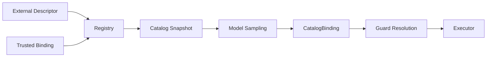

# Tool Schema、Registry 与 Dynamic Catalog

## 学习目标

理解 Tool Descriptor、Registry Authority、Immutable Sampling Snapshot、Deferred
Materialization 与 Catalog-bound Execution。

## Tool 不只是函数

Tool Contract 分为两层：`ExternalDescriptor` 声明 Name、Description、JSON Input
Schema、Visibility、Alias 与 Requested Effects；`TrustedBinding` 声明 Capability、
Resource Resolver、Access Mode、Parallel/Repeat Policy、Sandbox Requirement、
Effect Contract 与 Required Controls。



Schema 规定调用形状，Trusted Binding 规定安全语义。外部 Requested Effects 保留用于
审计，但不能授予 Capability。

## 一个 Descriptor 中的四类 Contract

| Contract | Field | Consumer |
| --- | --- | --- |
| Model Interface | External Name、Description、Schema、Alias、Visibility | Provider/Context |
| Authority | Trusted Capability、Effect、Resource Resolver、Sandbox、Controls | Guard/Policy/Authority |
| Scheduling | Trusted Parallel Policy、Resolved Resource | Claims/Scheduler |
| Lifecycle | Availability、Deferred、Source/Revision | Catalog/Host |

Registry 校验跨字段不变量，例如 Process Resource 必须绑定 Process/External Capability、
Write Resource 不能绑定 Read Capability、Before-image Transaction 必须是 Workspace
Edit。MCP 等外部 Source 必须显式提供可信 Binding；Legacy
Registration 会 Fail Closed。

Model 只看到 Public Tool Definition；Private Catalog Authority/Execution Metadata 不进入
Provider Request。

## Dynamic Catalog

Registry 有 Catalog ID/Generation；Entry 有 Source、Revision、Private Authority Token、
Lifecycle State、Frozen External Descriptor 和 Trusted Binding Digest。`Reconcile`
以可选 Generation CAS 原子更新一个 Source 的 Desired State。Replace/Revoke 更换
Authority，并留下 Tombstone 用于稳定分类。

`CatalogSnapshot` 深拷贝且排序。Sampled Tool Call 携带 ID、Generation、Revision 与
进程内 Authority。`ResolveBound` 拒绝未广告或 Sampling 后发生变化的 Entry。

不同 Catalog Identity 回答不同问题：

- Catalog ID：哪个 Registry Namespace 广告 Tool？
- Generation：Sample 的 Atomic Catalog State？
- Revision：哪个 Source Entry Version？
- Authority Token：是否为相同 In-process Executor Admission？

只匹配 Name 无法回答这些问题。

## Deferred Tools 与 Search

Deferred Entry 在 Executor 加载前公开 External Presentation。`tool_search` 搜索、排序并
Materialize 匹配 Tool；Entry Count/Schema Byte Limit 控制增长。并发加载合并，加载时
Schema/Alias/Trusted Binding Drift 失败。Executor 只能动态收紧 Availability。

Large Result 也受 Catalog 约束：Registry 对 Inline Content 设置界限，超限时返回 Handle；
`result_get` 提供 Bounded Retrieval，Handle 不能绕过 Hard Cap。

## Typed Tool Kit

`internal/adapter/tool/typed` 与 `internal/adapter/tool/result` 是受治理 Tool 的标准
构造 Kit。`tool.ValidateDescriptor` 在不注册 Executor 的前提下校验稳定 Registry
Contract；`typed.Define[I, O]` 将 Typed `Spec{Descriptor, TrustedBinding, Decode,
Validate, Run, Encode, Metadata}` 包装为 `tool.Executor`：

- 在接入 Catalog 之前完成校验；
- Strict Decode 拒绝 Unknown Field、`null` 与 Trailing JSON Value；
- Run Panic 变成 Execution Error 而不是 Crash；
- Encoded Result 离开 Executor 前通过 `result.Validate`。

`typed.ReadTool`、`typed.WriteTool`、`typed.ProcessTool` 以正确的 Visibility、
Capability、Access、Parallel、Sandbox 要求构造 Descriptor，避免 Tool 声明比其 Effect
更弱的 Security Contract。Policy-sensitive 字段必须显式：Builder 接收
`DescriptorPolicy{ResourceResolver, Availability, RepeatPolicy}`，`typed.Define`
拒绝 `RepeatPolicy` 为空的 Descriptor，可重复性始终是决策而非推断默认。
`tool/result` 编码 Model Content 与 Structured Metadata（`Success`、`Text`、带
`error_category`/`retryable` 的 `Fail`、`Unavailable`）；Output Limit、Truncation
与 Handle Routing 仍归 Registry 所有。Kit 不做 Execution/Policy Decision：
Registry Validation、Authorization、Guard、Sandbox Policy 都在 Kit 之外。

Typed Boundary 是所有 Executor 的默认路径，进程、Handle、Automation 与 MCP
Helper Call 均解码为静态输入类型。Schema 由他方拥有的
Executor 以例外方式保留 Raw JSON，并必须在 `typed-boundary-exception:` 注释中说明
原因——该注释由 Migration Guard Test 强制，例如 Schema 属于远端 Catalog 的
Remote MCP Tool。

`ErrorCategory` 为稳定路由分类失败：`unknown_tool`、`tool_unavailable`、
`invalid_arguments`、`tool_precondition`，与原有 catalog-stale、revoked、
load-failed 类别并列。共享的 `executor_contract_test.go` 覆盖完整契约——Descriptor
校验、Authorization 要求、Schema 错误以 `ErrInvalidArguments` 呈现、Output
Truncation 与 Handle Routing、Guard 路径、Panic 包容、Cancellation 传播、Metadata
JSON-compatibility，以及保持 Catalog Identity 的 Deferred Materialization。

## 代码地图

| 关注点 | 源码 |
| --- | --- |
| External/Trusted Contract | `adapter/tool/contract.go` |
| Descriptor/Registry | `adapter/tool/tool.go` |
| Snapshot/Reconcile | `adapter/tool/catalog.go` |
| Deferred Discovery | `adapter/tool/toolsearch` |
| MCP Reconcile | `adapter/tool/mcp` |
| Typed Kit | `adapter/tool/typed`、`adapter/tool/result` |

## 设计取舍

静态列表无法支持 MCP Tool 变化；仅按 Name 解析存在 TOCTOU 替换风险。Snapshot Binding
既保留动态发现，又确保执行的就是模型 Sample 时看到的 Authority。

## 失败模式与安全边界

- 无效 Schema/Capability/Access/Sandbox Metadata 拒绝注册。
- Alias Conflict 使 Reconcile 原子失败。
- Revoked 与 Stale 有独立错误类别。
- Unadvertised Tool Call 不可执行。
- Deferred Loader 不得改变 Frozen Schema/Alias/Trusted Binding。
- External Requested Effects 不得覆盖 Trusted Binding。
- Materialization Limit 失败不产生部分 Catalog Change。

## 测试与验证

```bash
go test ./internal/adapter/tool -run 'Test(CatalogSnapshot|Registry)'
go test ./internal/adapter/tool/toolsearch ./internal/adapter/tool/mcp
go test ./internal/adapter/tool/typed ./internal/adapter/tool/result
```

## 动手实验

追踪 `TestRegistryResolveBoundRejectsReplacedAndRevokedEntries`：捕获 Binding，依次 Replace
和 Revoke Entry，解释两次拒绝。

## 复习问题

1. JSON Schema 为什么不足以表示安全语义？
2. Catalog Binding 防止什么？
3. Deferred Loading 为什么必须保持 Frozen Descriptor？
4. 哪些 Descriptor Field 影响 Authorization 而非 Model Syntax？
5. Catalog ID、Generation、Revision、Authority 为什么不同？

## 延伸阅读

- [Tool Guard 执行管线](./03-tool-guard-pipeline.md)

## 事实来源与验证

| 项目 | 值 |
| --- | --- |
| Catalog ID | `tool-schema-registry` |
| 状态 | `draft` |
| 最后验证 | 尚未验证 |
