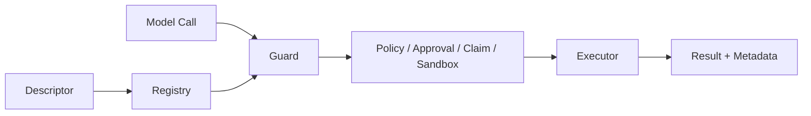

# 新增受治理 Tool

## 学习目标

实现具有完整 Schema、Resource、Capability、Sandbox、Parallelism、Result 与 Test
Contract 的 Tool。

## 扩展清单

1. 用 `typed.Define` 实现 Executor：Typed `Spec` 包含 `Decode`、`Validate`、
   `Run`、`Encode` 与可选 `Metadata`。
2. 使用 Strict Object Schema 和 `additionalProperties: false`。
3. 声明 Visibility、Capability、Access、Resource Template、Parallel Policy、
   Repeat Policy、Sandbox Requirement、Availability 与 Alias。
4. 通过 `tool/result` Builder（`Success`、`Text`、`Fail`、`Unavailable`）编码
   Model Content 与 Structured Runtime Metadata；Output Limit 与 Handle Routing
   由 Registry 执行。
5. 只在任何 Side Effect 前使用 Precondition Error。
6. Mediated File Writer 实现 `EditPlanner`、Atomic Commit 与 Read-before-edit。
7. 在 Adapter/Wire 注册，Host 不直接调用。



Resource Resolution 必须在 Policy 前枚举所有可能 Effect。无法从 Normalized Argument
描述 Write Path 时，应拒绝或使用 Trusted Argument Expander。

## Typed Construction Kit

`typed.Define[I, O]` 是构建 Executor 的标准方式。Spec 分离 `Decode`（Strict JSON，
拒绝 Unknown Field）、`Validate`（任何 Effect 前的 Precondition）、`Run`、`Encode`
与 `Metadata`。`tool.ValidateDescriptor` 在 Tool 接入 Catalog 前使 Construction
失败；`typed.ReadTool`/`WriteTool`/`ProcessTool` 提供对应 Effect Class 的
Capability、Access 与 Sandbox 要求，并接收显式 `DescriptorPolicy`（Resource
Resolver、Availability、Repeat Policy），Policy-sensitive 字段是决策而非推断默认
——`typed.Define` 拒绝空的 Repeat Policy。`tool/result` Builder 保持 Model Content
可编码、Metadata Structured 且 JSON-compatible；Result Bounding 与 Routing 仍由
Registry 负责。

几乎所有 Executor 都经过 Typed Boundary，包括进程、Handle、Automation 与 MCP
Helper。当 Schema 由他方拥有（Remote MCP Catalog，或 Concrete
Identity 拥有自身 Contract 的 Executor）时，只有在带 `typed-boundary-exception:`
注释说明（Migration Guard Test 强制）的前提下才保留 Raw JSON。

## Registration、Snapshot 与 Binding

Registry 验证 Descriptor 并分配 Source/Revision。Catalog Snapshot 是 Immutable
Model-visible View。Sampling 将 Tool Name 绑定到 Snapshot；Execution 使用
`ExecuteBound`，因此 Sampling 后 Replace/Revoke 会失败，而非用旧 Model Decision
执行新代码。

```text
register descriptor/executor
 -> validate identity/schema/effect
 -> publish catalog generation
 -> bind sample to generation/revision
 -> guard revalidates bound call
 -> execute exact implementation
```

Alias 归一到 Canonical Identity。Revoke 后重新注册产生 New Revision，Stale Executor
Handle 被 Fence。

## Effect/Result Contract

Descriptor Claim 是 Upper Bound。Resource Expansion 在 Policy 前把 Argument 转为具体
File、Command、Host、Service；Guard 比较 Declared/Observed Effect。

Model Content 是 Bounded Feedback；Structured Metadata、Handle、Journal Change、
Verification 是 Runtime Evidence。“Success”文本不能覆盖 Failed Process、Unobserved
Write 或 Revoked Binding。

## 失败与安全边界

- Tool 不构造/禁用自己的 Sandbox。
- Capability 与真实 Effect 一致。
- Executor Output 不自我授权。
- Partial Side Effect 不得标记 Precondition。
- Oversized Output 使用 Result Handle。
- Guard 观察实际 Write。
- 保留 Raw JSON 的 Executor 必须写明 `typed-boundary-exception:` 理由；Schema
  所有权始终显式，而非偶然。

## 测试与验证

```bash
go test ./internal/adapter/tool
go test ./internal/adapter/tool/guard
go test ./internal/adapter/tool/typed ./internal/adapter/tool/result
```

## 动手实验

用 `typed.ReadTool`/`typed.Define` 新增 Read-only Fixture Tool，验证 Invalid
Schema、Traversal、Unadvertised Binding 在 Execute 前失败。

## 复习问题

1. Resource Resolver 为什么属于 Descriptor？
2. Tool 何时可返回 `ErrPrecondition`？
3. Host 为什么不能直接调用 Executor？
4. 为什么 Sampled Tool 要绑定 Catalog Revision？
5. 哪些 Result 属于 Feedback，哪些属于 Runtime Evidence？

## 延伸阅读

- [Tool Guard 执行管线](../06-tools-and-execution/03-tool-guard-pipeline.md)

## 事实来源与验证

| 项目 | 值 |
| --- | --- |
| Catalog ID | `extension-tool` |
| 状态 | `draft` |
| 最后验证 | 尚未验证 |
